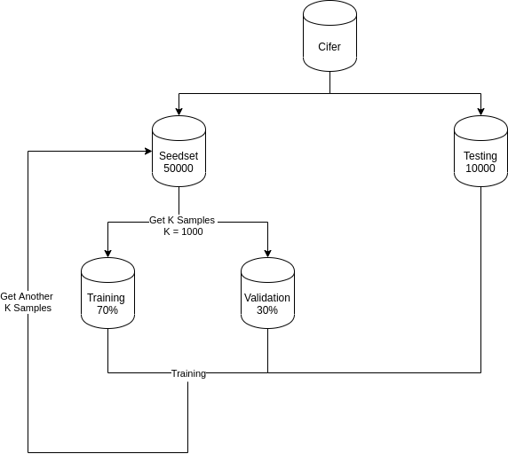

# Active Learning

This is my Active Learning Testing Repo.

1. Run al.ipynb for python notebook.
2. Run al.py for pure python.

Sampling methods 
---------------
1.Query by commitee 
 > 1. vote entropy
 > 2. average KL divergence
2. Uncertainty Sampling
 > 1. least confident
 > 2. max-margin
 > 3. entropy
3. Random sampling

Ref : Active Learning Literature Survey (https://minds.wisconsin.edu/bitstream/handle/1793/60660/TR1648.pdf?sequence=1)
Ref : https://towardsdatascience.com/active-learning-tutorial-57c3398e34d
